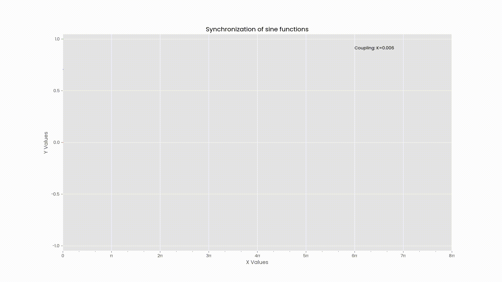

# Kuramoto Model

An animation of sine functions using the [Kuramoto Model](https://en.wikipedia.org/wiki/Kuramoto_model)

## Usage

```bash
usage: python graph.py [-h] [-d] K

An animation of synchronization of sine functions.

positional arguments:
  K            Coupling constant for the sine functions

optional arguments:
  -h, --help   show this help message and exit
  -d, --debug  Show the plot instead of writing to a file
```

## Example



## Running

-   Create `conda` env from environment.yml (see [Install Conda](https://conda.io/projects/conda/en/latest/user-guide/install/index.html))
-   From the root of the folder,

```bash
python ./graph.py
```

-   It will generate the files into ./recordings/
-   Or use `-d` and it will display the matplotlib window

## Meta

I got the inspiration to make this from [standupmath's](https://www.youtube.com/user/standupmaths) [video](https://www.youtube.com/watch?v=J4PO7NbdKXg)
on a spreadsheet representation of the Kuramoto model.
